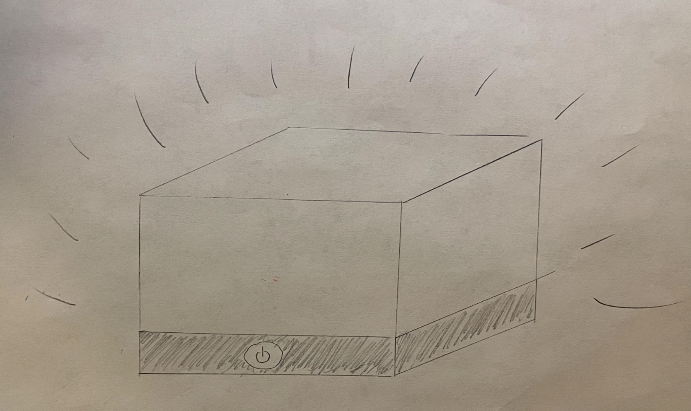
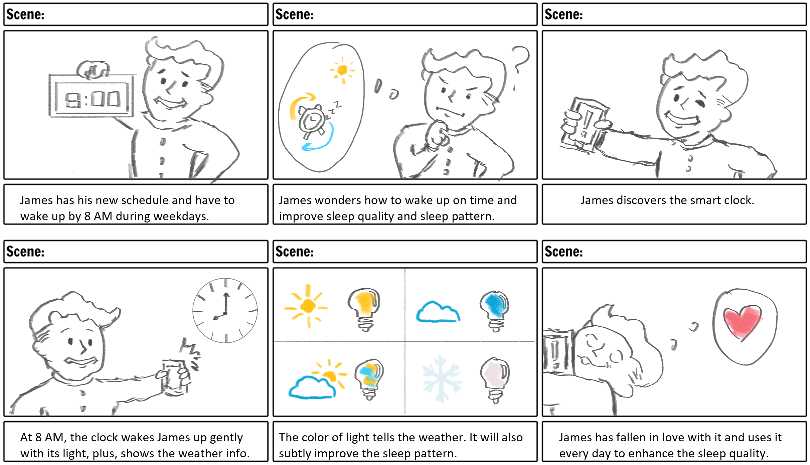

# Staging Interaction

In the original stage production of Peter Pan, Tinker Bell was represented by a darting light created by a small handheld mirror off-stage, reflecting a little circle of light from a powerful lamp. Tinkerbell communicates her presence through this light to the other characters. See more info [here](https://en.wikipedia.org/wiki/Tinker_Bell).

There is no actor that plays Tinkerbell--her existence in the play comes from the interactions that the other characters have with her.

For lab this week, we draw on this and other inspirations from theatre to stage interactions with a device where the main mode of display/output for the interactive device you are designing is lighting. You will plot the interaction with a storyboard, and use your computer and a smartphone to experiment with what the interactions will look and feel like. _Make sure you read all the instructions and understand the whole of the laboratory activity before starting!_

## Prep

1. Set up [your Github "Lab Hub" repository](../../../) by [following these instructions](https://github.com/FAR-Lab/Developing-and-Designing-Interactive-Devices/blob/2021Spring/readings/Submitting%20Labs.md).
2. Set up the README.md for your Hub repository (for instance, so that it has your name and points to your own Lab 1) and [learn how](https://guides.github.com/features/mastering-markdown/) to post links to your submissions on your readme.md so we can find them easily.

### For lab, you will need:

1. Paper
1. Markers/ Pen
1. Smart Phone--Main required feature is that the phone needs to have a browser and display a webpage.
1. Computer--we will use your computer to host a webpage which also features controls
1. Found objects and materials--you’ll have to costume your phone so that it looks like some other device. These materials can include doll clothes, a paper lantern, a bottle, human clothes, a pillow case. Be creative!
1. Scissors

### Deliverables for this lab are:
1. Storyboard
1. Sketches/photos of costumed device
1. Any reflections you have on the process.
1. Video sketch of the prototyped interaction.
1. Submit these in the lab1 folder of your class [Github page], either as links or uploaded files. Each group member should post their own copy of the work to their own Lab Hub, even if some of the work is the same for each person in the group.

## Overview
For this assignment, you are going to

A) [Plan](#part-a-plan)

B) [Act out the interaction](#part-b-act-out-the-interaction)

C) [Prototype the device](#part-c-prototype-the-device)

D) [Wizard the device](#part-d-wizard-the-device)

E) [Costume the device](#part-e-costume-the-device)

F) [Record the interaction](#part-f-record)

## The Report
This readme.md page in your own repository should be edited to include the work you have done. You can delete everything but the headers and the sections between the **stars**. Write the answers to the questions under the starred sentences. Include any material that explains what you did in this lab hub folder, and link it in the readme.

Labs are due on Mondays. Make sure this page is linked to on your main class hub page.

## Part A. Plan

To stage the interaction with your interactive device, think about:

_Setting:_ Where is this interaction happening? (e.g., a jungle, the kitchen) When is it happening?

_Players:_ Who is involved in the interaction? Who else is there? If you reflect on the design of current day interactive devices like the Amazon Alexa, it’s clear they didn’t take into account people who had roommates, or the presence of children. Think through all the people who are in the setting.

_Activity:_ What is happening between the actors?

_Goals:_ What are the goals of each player? (e.g., jumping to a tree, opening the fridge).

The interactive device can be anything *except* a computer, a tablet computer or a smart phone, but the main way it interacts needs to be using light.

**_Setting:_** The interaction happens at people's bedroom - the sleep pattern is vital to people's daily life and work performance. The wake-up light could help people to adjust their internal body clock and therefore enhance the sleep quality (Borbely, A. A., & Achermann, P. (1992). Concepts and models of sleep regulation: An overview. Journal of Sleep Research). The design of this device is to work as a smart lamp that wake up users according to their sleep pattern. In addition, the color of light will intuitively tell the users the basic information of today's weather. (耗子尾汁，How's the weather)

**_Players:_** The players involved in this interaction are the users in their bedrooms. Usually, this smart lamp will only serve one user since it will adapt to only one user's sleep pattern; it is not recommended to be user in a bedroom that has multiple people because it may interrupts other people's sleep. In that case, the lamp will only follow the preset schedule like a normal alarm clock.

**_Activity:_** The player will be waked up by the smart light and being informed by the color of the light to know the basic weather information.

**_Goals:_** The player will wake up on time and gradually adjust their sleep pattern to the optimal.

Sketch a storyboard of the interactions you are planning. It does not need to be perfect, but must get across the behavior of the interactive device and the other characters in the scene.

Present your idea to the other people in your breakout room. You can just get feedback from one another or you can work together on the other parts of the lab.

**Feedbacks:**Eric and Heidi thought it was a good idea of building a handy smart home device. Although the concept seems a little bit commonplace, the innovation in the detail still makes it a practical device in the daily life.

## Part B. Act out the Interaction

Try physically acting out the interaction you planned. For now, you can just pretend the device is doing the things you’ve scripted for it.

**Are there things that seemed better on paper than acted out?**

**There are not quite a lof of differences** since the concept is relatively simple and requires minimal manipulations from the users, therefore the only thing that seemed better on paper is the reaction speed of the device: when acting out, it takes time to adjust the brightness and the color of the light.

**Are there new ideas that occur to you or your collaborators that come up from the acting?**

The light could deliver even more information than weather. There is a full color palette in tinkerbelle and therefore it could display way more information than the original design.

On the other hand, although I deliberately exclude the audio element in the original design, I finally decide to involve audio/voice interaction in this device to enhance the user experience and the information delivery.

## Part C. Prototype the device

You will be using your smartphone as a stand-in for the device you are prototyping. You will use the browser of your smart phone to act as a “light” and use a remote control interface to remotely change the light on that device.

Code for the "Tinkerbelle" tool, and instructions for setting up the server and your phone are [here](https://github.com/FAR-Lab/tinkerbelle).

We invented this tool for this lab!
**Give us feedback on Tinkerbelle:**

The overall design is great. The interface is intuitive and easy to use. Admittedly there are some connection issues during the setup, but they could be resolved in the future version to enhance the compatibility and the robustness.

## Part D. Wizard the device
Take a little time to set up the wizarding set-up that allows for someone to remotely control the device while someone acts with it. Hint: You can use Zoom to record videos, and you can pin someone’s video feed if that is the scene which you want to record.

**First attempt set-up video:** https://drive.google.com/file/d/1mCiNmq1LRgm_5enLPFR1ORy4KInUGv8z/view?usp=sharing

Now, hange the goal within the same setting, and update the interaction with the paper prototype.

**Follow-up work paper prototype:** https://drive.google.com/file/d/1ZEmXcG8bFWZv0Na1BPMZkCqOYQU8VQFw/view?usp=sharing

## Part E. Costume the device

Only now should you start worrying about what the device should look like. Develop a costume so that you can use your phone as this device.

Think about the setting of the device: is the environment a place where the device could overheat? Is water a danger? Does it need to have bright colors in an emergency setting?

**Sketches of the device:** 

**What concerns or opportunitities are influencing the way you've designed the device to look?**

Minimalism.

Since the device requires minimal manipulations from the users. It will be fully automated and controlled by the internal system and software.

## Part F. Record

**Video of the prototyped interaction:** https://drive.google.com/file/d/13bTx9ULjG-7WnsCAiTySZff-MyniG7Vp/view?usp=sharing

**Please indicate anyone you collaborated with on this Lab.**
I collaborated with Eric Chen, Heidi He, and Ahaan Parekh in the breakout room. I finished the prototyping and the video recording by myself.

# Staging Interaction, Part 2

This describes the second week's work for this lab activity.

## Prep (to be done before Lab on Wednesday)

You will be assigned three partners from another group. Go to their github pages, view their videos, and provide them with reactions, suggestions & feedback: explain to them what you saw happening in their video. Guess the scene and the goals of the character. Ask them about anything that wasn’t clear.

**Summarize feedback from partners:**

Erin Gong: The video is very clear about the goals and the activities. I really like your idea of changing the light color based on the weather of the day (and the stock price of course)! My only concern would be that the device may not be as beneficial to people who don’t have black out curtains. Adding a sound and/or vibration option might make the device more widely accepted.

Jingjun Wang: You explained really well the functionalities and purposes of the wake-up-light. I saw in the video how the light switched colors to signal different weather conditions. The irony at the end where the light showed sympathy by laughing and clapping is hilarious. It'd be interesting if the light can also remind users to sleep after a certain hour when they break their sleep patterns.

Yanjun Zhou: This is a very interesting design which I can see that the light is used as an indicator of the status the car itself and its surrounding traffic condition. Green light is a sign of the safe condition while the red or flashing pink are corresponding to some dangerous operations or traffic condition, while the latter I cannot clearly tell the difference between them. My suggestion is that the use of the light can be simplified into a certain number of kinds to let the user memorize function of each light more easily. Besides, sound effects can be applied to improve the user experience.

Heidi He: Your design of this small interactive piece is fun and useful. This smart lamp can be seamlessly embedded in our daily life. The interaction is simple and intuitive. It serves a sleepy user well by simplifying the number of actions from a user. Moreover, the color matches the theme of the weather, reflecting one’s feelings on each particular day. The Chinese translation and the small decorations are very cute and make this product more humane.

Eric Chen: I like the idea of the device especially how you thought of and implemented sound effects with the color. As a Robinhood user, I find it interesting on how the light would instantly show me the  trend of the stocks I have. Although it might be a very subjective matter, it's still quite an interesting concept and I can see people using it. My suggestion would be since you are implementing the audio, you can combine it and provide some useful data such as telling the user the temperature and wind chill.
Also I am wondering if the light is supposed to wake people up, or it's just a complimentary feature on top of the actual alarm clock? If it is, the brightness of the light might be quite important.

## Make it your own

Do last week’s assignment again, but this time:
1) It doesn’t have to (just) use light,
2) You can use any modality (e.g., vibration, sound) to prototype the behaviors,
3) We will be grading with an emphasis on creativity.

**Document everything here.**

Sketch a storyboard of the interactions you are planning. It does not need to be perfect, but must get across the behavior of the interactive device and the other characters in the scene.

The major improvement I made here are:

1) On top of the ordinary alarm clock feature, I made this smart device being more "smart": Now it leverages the power of machine learning and the sleep pattern database to further improve the sleep pattern of the users. When the users are about to break their sleep patterns, the clock will send alarm by light and voice to tell the users it is time to sleep/wake up and it is important to keep it up; if they really can't follow the suggestion, the clock will adapt to the new pattern and gently help the users to adjust in the future weeks to come back to the healthier patterns.

2) The vibration and sound are now available. Although it is not suppose to use sound to wake people up like a normal clock, which is less effective comparing with specific lights, the voice could convey more information such as the detailed temperature to help the users prepare for the heat wave or the wind chill. It could also plays user's favorite news and podcasts such as stock markets and traffic information.

3) The light will also provides charging ports for smartphones.

**Video of the prototyped interaction:**

https://drive.google.com/file/d/1LdNCG1NFEX9alwUQdFqKSQ9UoM5LLYL1/view?usp=sharing

**Please indicate anyone you collaborated with on this Lab.**

 I finished the prototyping and the video recording by myself. Credit to my cat (Ergo) who starred in my demo video.
