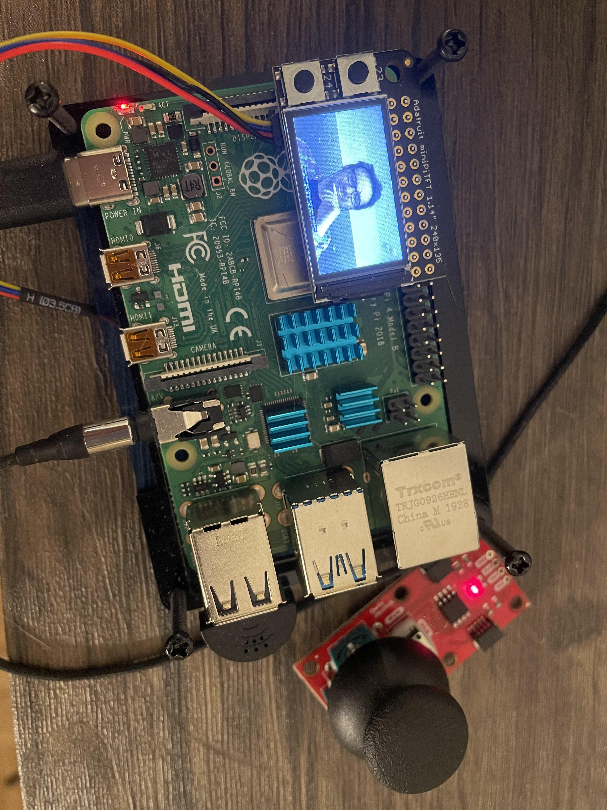
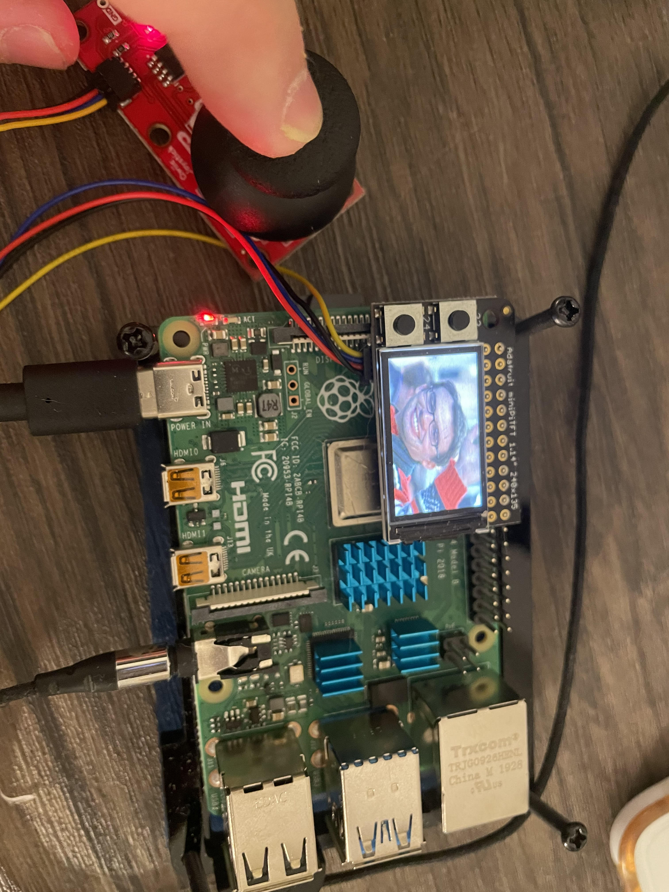
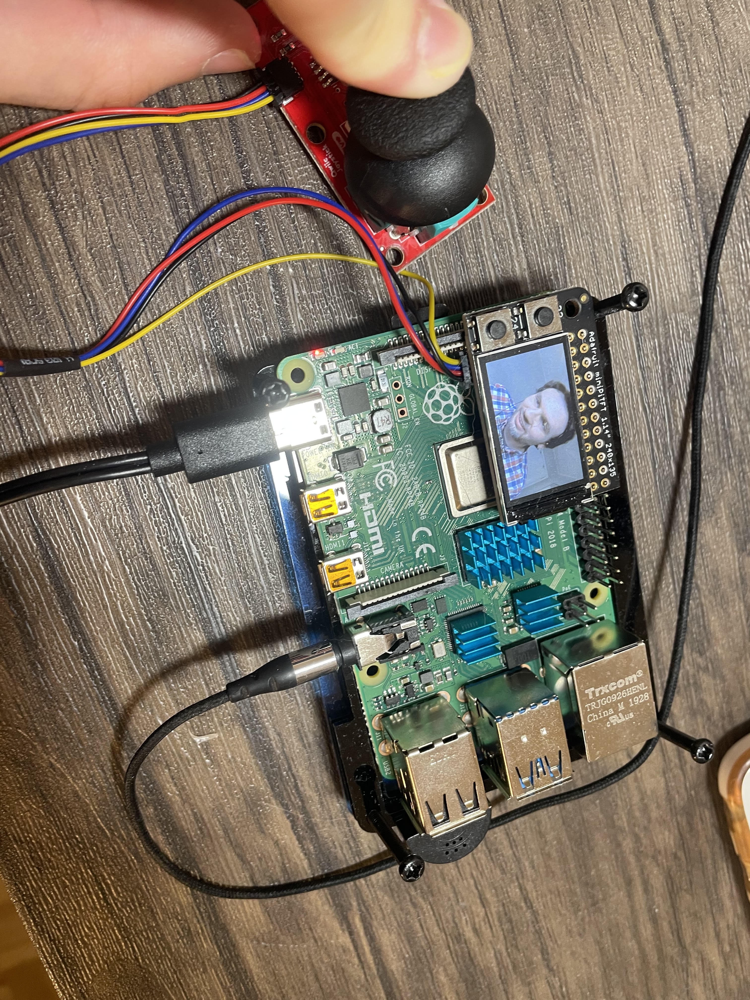
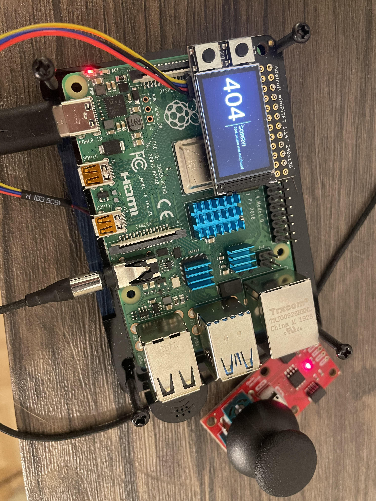

# You're a wizard, [Student Name Here]


In this lab, we want you to practice wizarding an interactive device as discussed in class. We will focus on audio as the main modality for interaction but there is no reason these general techniques can't extend to video, haptics or other interactive mechanisms. In fact, you are welcome to add those to your project if they enhance your design.


## Text to Speech and Speech to Text

In the home directory of your Pi there is a folder called `text2speech` containing some shell scripts.

```
pi@ixe00:~/text2speech $ ls
Download        festival_demo.sh  GoogleTTS_demo.sh  pico2text_demo.sh
espeak_demo.sh  flite_demo.sh     lookdave.wav

```

you can run these examples by typing 
`./espeakdeom.sh`. Take some time to look at each script and see how it works. You can see a script by typing `cat filename`

```
pi@ixe00:~/text2speech $ cat festival_demo.sh 
#from: https://elinux.org/RPi_Text_to_Speech_(Speech_Synthesis)#Festival_Text_to_Speech

echo "Just what do you think you're doing, Dave?" | festival --tts

```

You can also play audio files directly with `aplay filename`.

After looking through this folder do the same for the `speech2text` folder. In particular, look at `test_words.py` and make sure you understand how the vocab is defined. Then try `./vosk_demo_mic.sh`

## Serving Pages

In Lab 1 we served a webpage with flask. In this lab you may find it useful to serve a webpage for the controller on a remote device. Here is a simple example of a webserver.

```
pi@ixe00:~/$ python server.py
 * Serving Flask app "server" (lazy loading)
 * Environment: production
   WARNING: This is a development server. Do not use it in a production deployment.
   Use a production WSGI server instead.
 * Debug mode: on
 * Running on http://0.0.0.0:5000/ (Press CTRL+C to quit)
 * Restarting with stat
 * Debugger is active!
 * Debugger PIN: 162-573-883
```
From a remote browser on the same network, check to make sure your webserver is working by going to [http://ixe00.local:5000]()


## Demo

In the [demo directory](./demo), you will find an example wizard of oz project you may use as a template. **You do not have to** feel free to get creative. In that project, you can see how audio and sensor data is streamed from the Pi to a wizard controller that runs in the browser. You can control what system says from the controller as well.

## Optional

There is an included [dspeech](./dspeech) demo that uses [Mozilla DeepSpeech](https://github.com/mozilla/DeepSpeech) for speech to text. If you're interested in trying it out we suggest you create a seperarate virutalenv. 


# Lab 3 Part 2

Create a system that runs on the Raspberry Pi that takes in one or more sensors and requires participants to speak to it. Document how the system works and include videos of both the system and the controller.

## Prep for Part 2

1. Sketch ideas for what you'll work on in lab on Wednesday.

This is a parody piece of Prof. Noah Snavely of Cornell's CS department. 

When user says "This is so cool" or "cool", the screen of Raspberry Pi will show the face of Prof. Snavely to send greetings.

If the user says something else, the screen will simply say "404, motivation was not found".

Only when the users said the magic word "cool", they may proceed to the next step:

They can use joystick to control the display to show different pics of Professor Snavely.

I gave the name to this design as "Raspberry Noah".

## Share your idea sketches with Zoom Room mates and get feedback

*what was the feedback? Who did it come from?*

Yanjun and Renzhi: This idea is sooooo cooooool!

## Prototype your system

The system should:
* use the Raspberry Pi 
* use one or more sensors
* require participants to speak to it. 

*Document how the system works:*

*Raspberry Noah*

The system requires two people: a player and an operator. The player have to guess and say the keyword (in this case, is "this is so cool" or "cool" which are the favorite terms of Prof. Snavely). If the word is wrong, the screen will show "404, motivation not found" and the game can not proceed. If the word is correct, then Prof. Noah Snavely's face will appear and greet the player. Then, the player can use the joystick to control the screen to see different photos of Noah saying "This is so cool".

The system requires the player use voice and joystick to control. The operator control the system with keyboard and the webapp. If the operater would like to, they are also able to use the text2speech to pass information to the player by the speaker or headphone.

*Include videos or screencaptures of both the system and the controller.*






## Test the system
Try to get at least two people to interact with your system. (Ideally, you would inform them that there is a wizard _after_ the interaction, but we recognize that can be hard.)

Answer the following:

### What worked well about the system and what didn't?
*The system worked well on both reacting to the microphone and the joystick. The webapp which referred to the demo worked as it should, and the joystick which allows the user to interact with Professor Snavely is very responsive.*

*However, the design at this moment still requires manual operation behind the scene which is similar to the demo. I used pygame pacakge to control the screen so when the operator hear keyword "cool" from the webapp they can manually change the information on screen (not including the joystick-controlled contents).*

*The original idea is to utilize the "speech2text" feature of Raspberry Pi to automatically recognize the keyword and then react, which does not require an operator. However, I found it is technically challenging especially in a short time. I will try to build it in future labs if I get the chance.*
### What worked well about the controller and what didn't?

*The joystick as the controller works pretty responsive and steady.The x and y coordinates which reflects the directions could be accurately captured.*

*The only thing the controller(s) did not work well is that because I don't have a bread board and therefore I can't add more controllers to the I2C bus. With only a single controller there are many features in my original ideas can not be realized.*

### What lessons can you take away from the WoZ interactions for designing a more autonomous version of the system?

*Using the speech2text feature to make a automated version instead of asking a human operator to work on it.*


### How could you use your system to create a dataset of interaction? What other sensing modalities would make sense to capture?

*The coordinates input from the joystick are valuable datasets. Also, the speech input could also be saved and created as dataset.*

